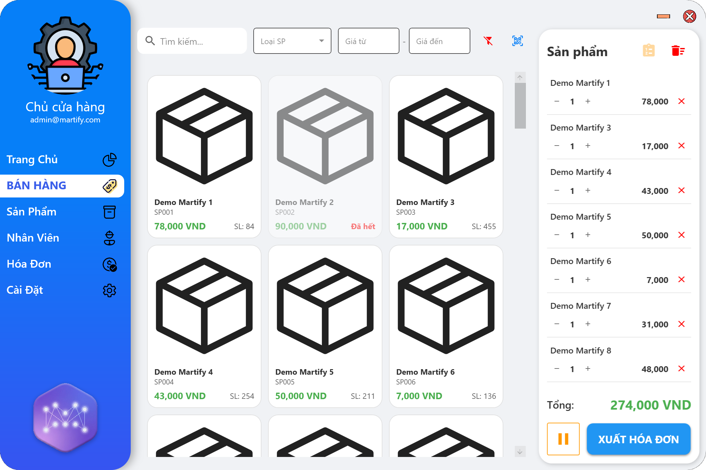
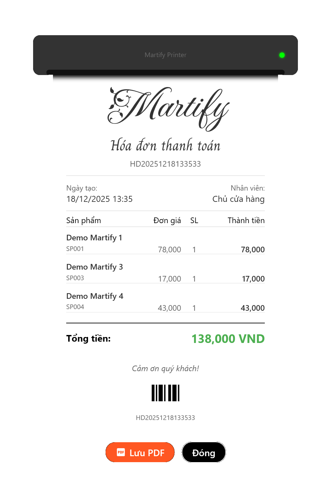

<p align="center">
  
</p>

<h1 align="center">MARTIFY - PHẦN MỀM QUẢN LÝ SIÊU THỊ</h1>

<p align="center">
  <strong>Đồ án môn học: Lập trình trực quan</strong>
</p>

<p align="center">
  <a href="#-giới-thiệu">Giới thiệu</a> •
  <a href="#-tính-năng-chính">Tính năng</a> •
  <a href="#-cấu-trúc-dự-án">Cấu trúc</a> •
  <a href="#-công-nghệ-sử-dụng">Công nghệ</a> •
  <a href="#-hình-ảnh-minh-họa">Hình ảnh</a> •
  <a href="#-hướng-dẫn-cài-đặt--sử-dụng">Cài đặt</a>
</p>

---

## 👥 Sinh viên thực hiện

| STT | MSSV | Họ và tên | GitHub |
|:---:|:---:|:---:|:---:|
| 1 | **24520842** | Trần Lê Anh Khoa | [harutopia0](https://github.com/harutopia0) |
| 2 | **24521018** | Trần Việt Long | [TraVisL586](https://github.com/TraVisL586) |
| 3 | **24520812** | Đỗ Đăng Khoa | [DOKA206](https://github.com/DOKA206) |
| 4 | **24520692** | Phạm Viết Quang Huy | [phamhuy273](https://github.com/phamhuy273) |

---

## 📖 Giới thiệu

**Martify** là giải pháp phần mềm desktop dành cho các siêu thị mini và cửa hàng tiện lợi. Ứng dụng được xây dựng trên nền tảng **WPF (.NET 8)** với kiến trúc **MVVM**, tập trung vào trải nghiệm người dùng hiện đại (UI/UX) và bán hàng.

Mục tiêu của Martify là thay thế việc quản lý thủ công bằng một hệ thống số hóa chính xác, bảo mật và dễ sử dụng.

---

## 🚀 Tính năng chính

### 1. 🛒 Bán hàng & Thanh toán (POS)
* **Quét mã vạch thông minh:** Hỗ trợ quét QR Code sản phẩm bằng Webcam (sử dụng thư viện AForge & ZXing).
* **Xử lý đơn hàng:** Thêm/bớt sản phẩm, tính tổng tiền tự động.
* **Tạm giữ đơn hàng (Held Orders):** Cho phép lưu tạm giỏ hàng để phục vụ khách khác và thanh toán lại sau.
* **In hóa đơn:** Xuất hóa đơn ra file PDF chuẩn khổ giấy in nhiệt (80mm).

### 2. 📊 Dashboard & Báo cáo
* **Tổng quan doanh thu:** Biểu đồ cột hiển thị doanh thu theo tuần.
* **Phân tích:** Tự động tính toán % tăng trưởng so với tuần trước.
* **Top sản phẩm:** Hiển thị Top 5 sản phẩm bán chạy nhất kèm trạng thái (Siêu Hot, Bán tốt, Ổn định).

### 3. 📦 Quản lý Sản phẩm
* **Quản lý sản phẩm:** Thêm, xóa, sửa thông tin, hình ảnh sản phẩm.
* **Cảnh báo tồn kho:** Hệ thống tự động cảnh báo các mức:
    * 🟢 Bình thường
    * 🟡 Sắp hết hàng (Low Stock)
    * 🔴 Hết hàng (Out of Stock).
* **Nhập hàng:** Quy trình nhập kho từ nhà cung cấp, tự động cập nhật số lượng và giá vốn.

### 4. 👥 Quản lý Nhân sự
* **Hồ sơ nhân viên:** Quản lý thông tin cá nhân, chức vụ.
* **Import/Export Excel:** Tính năng nhập danh sách nhân viên hàng loạt từ file Excel và xuất dữ liệu ra Excel (sử dụng ClosedXML).
* **Phân quyền:**
    * **Admin:** Toàn quyền hệ thống.
    * **Staff:** Giới hạn chỉ truy cập chức năng bán hàng.

### 5. ⚙️ Tiện ích & Cài đặt
* **Giao diện:** Hỗ trợ **Dark Mode / Light Mode** chuyển đổi mượt mà.
* **Bảo mật:** Đăng nhập an toàn với mật khẩu được mã hóa **SHA256**.
* **Tra cứu giá:** Tool check giá nhanh tại Dashboard.

---

## 📂 Cấu trúc dự án

Dự án được tổ chức chặt chẽ theo mô hình **MVVM (Model - View - ViewModel)** giúp tách biệt logic và giao diện:

```text
Martify/
├── 📂 Models/           # Định nghĩa thực thể CSDL và DbContext (EF Core)
├── 📂 ViewModels/       # Logic nghiệp vụ, xử lý lệnh (Commands) và trạng thái
├── 📂 Views/            # Giao diện người dùng (Windows & UserControls)
├── 📂 Helpers/          # Các tiện ích: Mã hóa, Validate dữ liệu, Seed Data
├── 📂 Converters/       # Bộ chuyển đổi giá trị (Value Converters) cho XAML
├── 📂 Resources/        # Tài nguyên: XAML, Sounds, Fonts, Images, Styles
├── 📂 Behaviors/        # Các hành vi tương tác giao diện (Animations)
├── App.xaml             # Cấu hình khởi chạy và quản lý ResourceDictionary
├── LoginWindow.xaml     # Cửa sổ đăng nhập để truy cập ứng dụng
└── MainWindow.xaml      # Cửa sổ chính chứa thanh điều hướng và khung nội dung
```

---

## 🛠 Công nghệ sử dụng

| Lĩnh vực | Công nghệ / Thư viện |
| :--- | :--- |
| **Framework** | .NET 8, WPF (Windows Presentation Foundation) |
| **Kiến trúc** | MVVM (Model - View - ViewModel) |
| **Database** | SQLite + Entity Framework Core (Code First) |
| **Giao diện** | Material Design In XAML Toolkit |
| **Báo cáo/In ấn** | QuestPDF (Xuất PDF chuyên nghiệp) |
| **Xử lý Excel** | ClosedXML |
| **Camera/Barcode** | AForge.NET, ZXing.Net |

---

## 📸 Hình ảnh minh họa

### 1. Màn hình Đăng nhập
> Giao diện đăng nhập với hiệu ứng Animation chữ chạy và hình nền hiện đại.

<div align="center">
  
</div>

### 2. Dashboard (Bảng điều khiển)
> Hiển thị biểu đồ doanh thu và các thông số kinh doanh quan trọng.

<div align="center">
  <hình ảnh minh họa>
</div>

### 3. Giao diện Bán hàng (POS)
> Màn hình bán hàng trực quan, hỗ trợ tìm kiếm và quét mã.

<div align="center">
  
  
</div>

### 4. Quản lý Sản phẩm
> Danh sách sản phẩm và chức năng nhập hàng từ nhà cung cấp.

<div align="center">
  <hình ảnh minh họa>
</div>

### 5. Hóa đơn
> Mẫu hóa đơn được xuất ra từ phần mềm.

<div align="center">
  
</div>

---

## 📦 Hướng dẫn cài đặt & Sử dụng

### Yêu cầu hệ thống
* Hệ điều hành: Windows 10/11.
* .NET Runtime: .NET 8.0.

### Các bước cài đặt
1.  **Clone dự án:**
    ```bash
    git clone https://github.com/harutopia0/Martify.git
    ```
2.  **Mở dự án:** Mở file `Martify.sln` bằng Visual Studio 2022.
3.  **Build & Run:** Nhấn `F5` để chạy ứng dụng.

### Tài khoản mặc định
Để trải nghiệm đầy đủ tính năng, vui lòng sử dụng các tài khoản demo sau:

| Vai trò | Tên đăng nhập | Mật khẩu | Quyền hạn |
| :---: | :---: | :---: | :---: |
| **Quản lý (Admin)** | `admin` | `admin` | Toàn quyền |
| **Nhân viên (Staff)** | `staff` | `staff` | Chỉ truy cập Bán hàng & Tra cứu |

Lưu ý: Dữ liệu có sẵn chỉ có 2 tài khoản trên, các bảng dữ liệu khác sẽ trống.
Sao chép file `Martify.db` vào thư mục `bin\debug` và chọn ghi đè, chạy lại ứng dụng để dùng dữ liệu mẫu.

---

<p align="center">
  © 2025 Martify - UIT.
</p>
